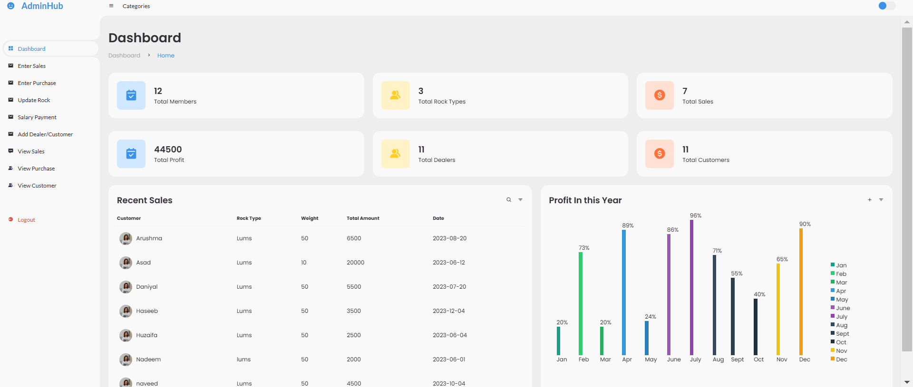
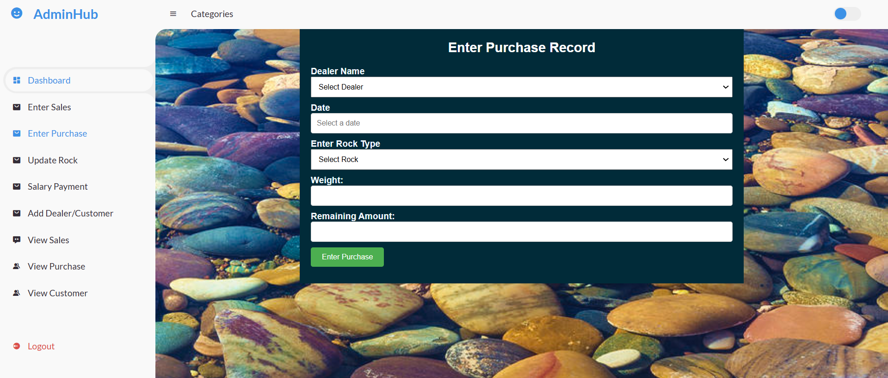
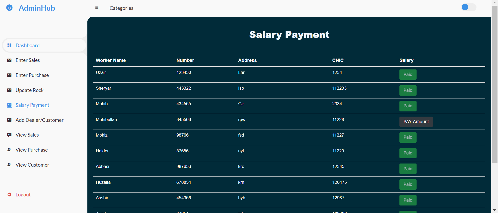
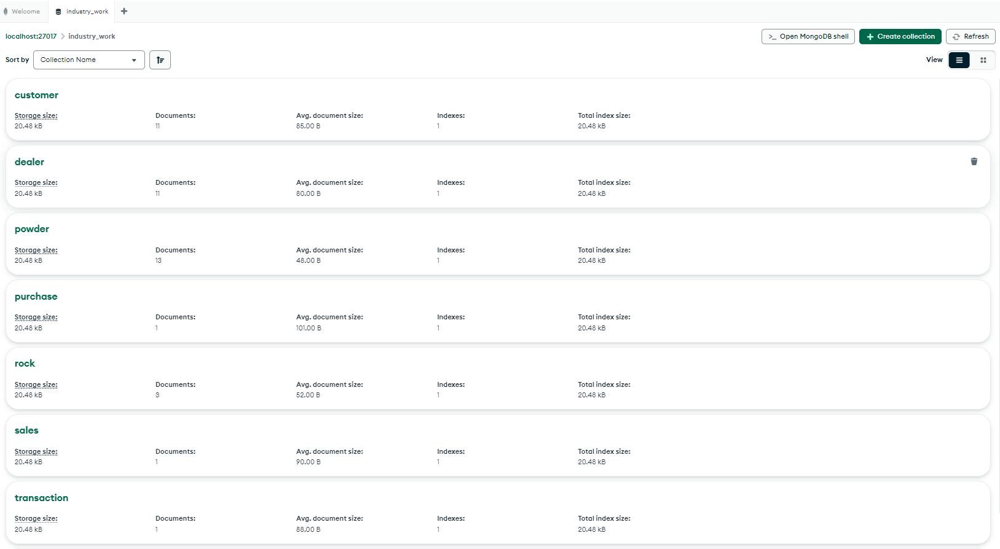

# Database Project for Handling Industry Sales  

This project is designed to manage and store sales records for a specific industry. It allows users to efficiently track and extract client or dealer data, including paid and remaining dues.  
This project is designed to **efficiently manage and store sales records** for a specific industry. It provides a comprehensive system to **track transactions, manage client and dealer data, and maintain financial records, including paid and remaining dues**. The system is built to enhance **workflow efficiency, accuracy, and data accessibility** for businesses dealing with multiple entities, such as **dealers, customers, sellers, and laborers**.

## 🛠️ Core Features

### 🔹 Dealer & Customer Management
- Stores complete profiles of **dealers and customers**.
- Tracks **financial transactions**, including **payments, dues, and pending balances**.
- Allows for **quick data retrieval and history tracking**.

### 🔹 Product & Resource Management
- Manages various types of **rocks** such as **Lums, Phosphate, Copper**, and their **crushes**.
- Records **sales, purchases, and processing details** for each product category.

### 🔹 Sales & Transaction Tracking
- Maintains **detailed sales records** associated with **dealers and customers**.
- Tracks **purchases, order fulfillment, and revenue generation**.
- Generates **real-time financial reports** to assess business performance.

### 🔹 Labor & Workforce Management
- Keeps records of **laborers** working on **extraction, crushing, and sales**.
- Tracks **salaries, work hours, and performance metrics**.

## 🚀 Key Benefits
✅ **Efficient Data Management** – Centralized storage for **dealers, customers, and sales data**.  
✅ **Accurate Financial Tracking** – Automated calculation of **dues, payments, and revenue**.  
✅ **Real-Time Sales Monitoring** – Live updates on **transactions and stock levels**.  
✅ **Scalability** – Easily expandable to handle **growing industry needs**.  

---

## Installation and Setup  

Follow these steps to set up and run the project:  

1. **Installation**  
   - Download and install [XAMPP](https://www.apachefriends.org/index.html).
   - Extract these folders in xampp/htdocs/Industrial-Sales-Management/

2. **Start the Required Services**  
   - Open the XAMPP Control Panel.  
   - Start **Apache Server** and **MySQL**.  

3. **Set Up the Database**  
   - Open Chrome and go to `http://localhost/`.  
   - Click on **phpMyAdmin** to open the MySQL database.  
   - Create a new database named **pharmacy**.  
   - Navigate to the **Import** tab.  
   - Select the SQL database file from the `database` folder and import it.  

4. **Run the Website**  
   - Open Chrome and visit:  
     ```
     http://localhost/Industrial-Sales-Management/adminhub-master/index.php
     ```
   - The login page will appear. 🎉  

Your website is now up and running! 🚀  


## Samples:  

Here is the view of the website pages:  

### Login Page  
  

### Dashboard  
  

### Purchase Page  


### Salary Payment  


### Database  

